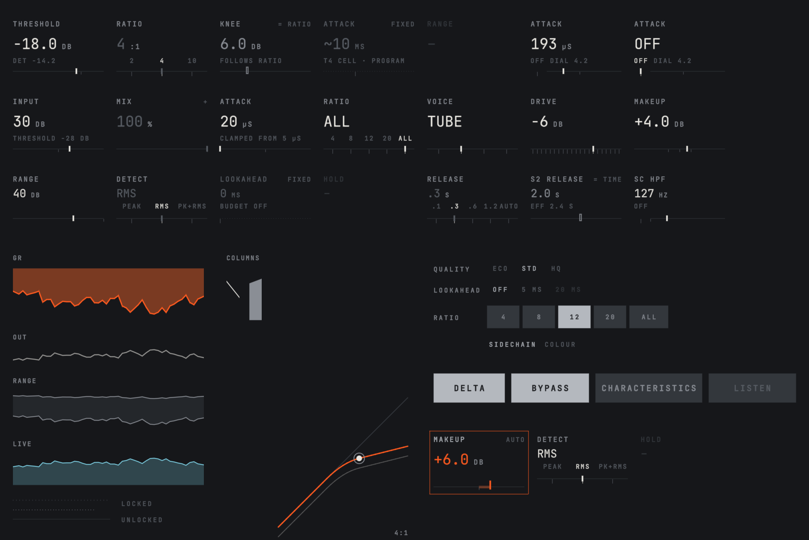

# FunkGui


[](LICENSE)

A GPU user-interface library for JUCE audio plugins on macOS and Linux. A plugin's interface is a `Panel` that draws
into a `Canvas`. The canvas records primitives on the CPU (rounded rectangles, lines, filled areas, signed-distance-field
text), and bgfx draws the recorded frame in one draw call, on Metal on macOS and on Vulkan on Linux. The same Panel also runs headless, in a console
process with a fixed clock and synthetic input, so a test can check its layout, text and accessibility against golden
files and render any frame to a PNG without a GPU. FunkGui also has a small widget set, a preset store and the test
harness itself.

FunkGui is the GUI of [FCompressor](https://github.com/Snipet/FCompressor). HardwareReverb, a private plugin whose GUI
code FunkGui grew from, has moved onto it too. FunkGui is at 0.x, and its API may change between minor versions.
Every release is an annotated tag on `main` (latest: `v0.10.0`), and [`CHANGELOG.md`](CHANGELOG.md) says what each
release does to a consumer's golden files.



*Sections of the widget gallery, rendered headless by `FunkGuiGalleryProbe` and `funkgui_framerender` (no GPU, no
window), cropped and tiled.*

## How it works

```
Panel         your UI: one fixed logical size, tick(dt), draw(Canvas&, Theme&), input, accessibility items
  |
Canvas        records primitives on the CPU into a PrimList; makes no GPU calls
  |
  +-- EditorHost + BgfxSink   live: a juce::AudioProcessorEditor; bgfx on Metal, one draw call per frame
  +-- HeadlessHost            tests: fixed dt, synthetic input -> frame dump, fingerprint, PNG, accessibility list
```

- A Panel reads no wall clock: time comes from `tick(dt)`. Every ease snaps onto its target, so with a fixed dt a
  headless run settles in an exact number of frames and draws the same frame every time.
- A fingerprint hashes a frame's geometry and text, leaving out colours and live data, so a test can pin a layout in a
  few golden rows. A GPU test captures a real Metal frame of the gallery app and checks that its hashes equal the
  headless frame's.
- The host scales the Panel uniformly for the display's backing scale and for optional zoom steps; the Panel always
  draws and takes input in its own logical pixels.

## Features by layer

Public headers live in `include/funkgui/<layer>/`, in namespace `funkgui` (`funkgui::presets` for the presets,
`funkgui::test` for the harness).

- **core**: geometry, colours, two themes (graphite and paper), the type scale, deterministic eases with one
  process-wide animation speed, locale-free number formatting, environment variables read under a product prefix.
- **canvas**: the recorder. Rounded rectangles (per-corner radii, borders, soft edges), hairlines snapped to device
  pixels, segments, polylines, filled areas and strips, discs, dotted rules and text. Each primitive carries a semantic
  tag and a live flag for tests. Nested clipping, a text dump format, fingerprints, and `SoftRaster`, a CPU rasteriser
  that mirrors the fragment shader.
- **text**: an SDF font atlas baked on the CPU from the bundled JetBrains Mono subset (printable ASCII and 19 symbols),
  text measurement and fitting, and `LineEdit`, the state of a one-line text field.
- **panel**: the `Panel` interface, `HostServices` (what a Panel may ask of its host), `HeadlessHost`, and the capture
  settings read from the environment.
- **params**: `ParamPort` (a host parameter as 0..1), `JuceParamPort` over a `juce::RangedAudioParameter`, and
  `GestureController`, which wraps every write in a begin/end gesture: drags, clicks, wheel bursts and batches of
  several parameters.
- **widgets**: `RuleSlider` (a label, a value and a 1 px rule with a caret; detents; live, stepped, locked, derived
  and n/a states), `SegmentedSelector`, `LatchToggle`, `AttachedWord`, `ThemeCells`, `HintLine`, `FocusRing` and
  `DwellSelector`. Widgets render models the product implements and write only through `GestureController`.
- **a11y**: the accessibility items a Panel lists, and their one-line text form for tests.
- **prefs**, **live**, **juce**: machine-wide UI preferences (theme, zoom, integer keys) in
  `~/Library/Application Support/<product>/` (Linux: `~/.config/<product>/`); `LiveFeed`, which tells a live telemetry stream from a stale one;
  `MenuLook`, the theme applied to JUCE popup menus.
- **gpu**: `EditorHost`, a `juce::AudioProcessorEditor` that runs one Panel on bgfx: Metal on a click-through NSView
  on macOS, Vulkan on an X11 child window of JUCE's peer on Linux (which is XWayland on a Wayland desktop). It handles
  the surface lifecycle with a no-GPU fallback screen, converts JUCE input, mirrors the accessibility items for the
  screen reader, offers UI zoom steps and can capture frames. `FramePump` gives every editor in the process one clock
  (a display link on macOS, a timer on Linux) and one `bgfx::frame()` per tick. On macOS the Objective-C classes are
  registered at run time under randomised names, so two products using FunkGui in one host never collide.
- **presets** (FunkPresets): a SQLite preset store shared by every plugin instance, a preset manager with product
  hooks, and an XML preset file format. It does not depend on the GUI layers.
- **test** (`test/Harness.h`): a header-only, JUCE-free probe harness. Spec rows are judged at once and never stored;
  golden rows are compared, with tolerances, against files under a golden root. Candidates are written outside the
  golden tree, each probe writes a JSON result, and exit codes run from 0 (pass) to 4 (harness error).

## Requirements

- **Platforms:** macOS 14 or later on Apple Silicon, and (from v0.11.0) x86-64 Linux. The GPU layer needs Metal on
  macOS and Vulkan on Linux; configure stops if `FUNKGUI_WITH_BGFX` is on anywhere else. The preset layer has Windows
  code paths (Windows' own SQLite) carried over from HardwareReverb; they are untested. The harness and golden tools
  also handle x86_64 (per-architecture golden overlays).
- **Tools:** CMake 3.30 or later, Ninja, Python 3 and git; Xcode or its command-line tools (Apple clang, C++20) on
  macOS, Clang on Linux (the default there unless `CC`/`CXX` say otherwise). Upstream Clang rejects a constructor
  template in JUCE 8.0.4's `juce_AudioPluginInstance.h`; where it does, `cmake/FunkGuiPlatform.cmake` adds
  `-fdelayed-template-parsing`, and a consumer does the same in its own scope.
- **Dependencies:** JUCE 8.0.4 (another version is a configure error unless `FUNKGUI_ALLOW_OTHER_JUCE=ON`);
  bgfx.cmake `v1.153.9385-561` (bgfx API 153 is checked); SQLite 3 for the presets (the macOS SDK's). On Linux also
  GLib (the preset keys' Unicode fold) and the development packages JUCE needs (ALSA, FreeType, Fontconfig, X11).

## Using FunkGui from CMake

Consume it with FetchContent at a tag. Make JUCE available first: FunkGui never fetches JUCE for a consumer, it
compiles against yours and checks the version.

```cmake
include(FetchContent)

FetchContent_Declare(JUCE GIT_REPOSITORY https://github.com/juce-framework/JUCE.git GIT_TAG 8.0.4 GIT_SHALLOW TRUE)
FetchContent_MakeAvailable(JUCE)

# Options are normal variables set before FetchContent_MakeAvailable(FunkGui); these two are the defaults.
set(FUNKGUI_WITH_BGFX ON)
set(FUNKGUI_WITH_PRESETS ON)
FetchContent_Declare(FunkGui GIT_REPOSITORY https://github.com/Snipet/FunkGui.git GIT_TAG v0.10.0)
FetchContent_MakeAvailable(FunkGui)

juce_add_plugin(MyPlugin FORMATS AU VST3 Standalone PRODUCT_NAME "My Plugin")   # plus your usual arguments
target_link_libraries(MyPlugin PRIVATE FunkGui::core FunkGui::gpu FunkGui::presets)
funkgui_configure_product(MyPlugin PRODUCT MyPlugin OBJC_PREFIX MyPl ENV_PREFIX MYPL_ PREFS_FOLDER MyPlugin)
funkgui_compile_shaders(MyPlugin)   # builds the embedded Metal and SPIR-V shaders before MyPlugin
funkgui_add_font(MyPlugin)          # the font's and bgfx's licences into each bundle's Resources
```

- **Targets.** `FunkGui::harness` (always), `FunkGui::core`, `FunkGui::gpu` (with `FUNKGUI_WITH_BGFX`),
  `FunkGui::presets` (with `FUNKGUI_WITH_PRESETS`), and `FunkGui` (core plus gpu). They are INTERFACE libraries that
  carry FunkGui's sources, so FunkGui compiles inside your target with your JUCE configuration. There is no install
  step and no package config.
- **Link PRIVATE.** A PUBLIC link on a `juce_add_plugin` target would compile FunkGui again into every format wrapper.
- **Product identity.** Every target that links `FunkGui::core` calls `funkgui_configure_product()`, which sets the
  product name, the Objective-C class prefix, the environment-variable prefix and the preferences folder. Without it,
  FunkGui's sources fail to compile.
- **bgfx.** In a GPU configuration FunkGui uses your `bgfx` target if one exists and otherwise fetches bgfx.cmake
  itself. The shaders are compiled with bgfx's `shaderc`, which is built from source (about 2,000 CPU-seconds) unless
  `FUNKGUI_SHADERC` names a prebuilt one. A prebuilt one should have a `shaderc.stamp` beside it naming the pinned
  bgfx.cmake commit; FunkGui warns otherwise. If you declare bgfx yourself, also build its shader tool
  (`BGFX_BUILD_TOOLS` and `BGFX_BUILD_TOOLS_SHADER` on) or set `FUNKGUI_SHADERC`.
- `FUNKGUI_VERSION` holds the version, for your own checks.

| Option | Default | Effect |
| --- | --- | --- |
| `FUNKGUI_WITH_BGFX` | ON | `FunkGui::gpu`, the shaders and bgfx. OFF: a headless build with no GPU code |
| `FUNKGUI_WITH_PRESETS` | ON | `FunkGui::presets` (links SQLite 3) |
| `FUNKGUI_HARNESS_ONLY` | OFF | Only `FunkGui::harness`; JUCE is not needed (DSP-only builds) |
| `FUNKGUI_BUILD_TOOLS` | ON at top level | The tool targets, such as `funkgui_framerender` (excluded from `all`) |
| `FUNKGUI_BUILD_TESTS` | ON at top level | FunkGui's own `fg.*` tests (needs the tools) |
| `FUNKGUI_ALLOW_OTHER_JUCE` | OFF | A JUCE version other than 8.0.4 is a warning instead of an error |
| `FUNKGUI_SHADERC` | empty | Path to a prebuilt, stamped `shaderc` |
| `FUNKGUI_TRANSIENT_VB_MIB` | 32 | bgfx's transient vertex buffer, in MiB, shared by every editor in the process |
| `FUNKGUI_WERROR` | ON | `-Werror` on FunkGui's own sources in its tools and tests |

FCompressor's [`cmake/FcmpDeps.cmake`](https://github.com/Snipet/FCompressor/blob/main/cmake/FcmpDeps.cmake) is a
complete consumer, with a version and commit check on every dependency.

### A Panel, live and headless

A sketch of the smallest Panel and its two hosts:

```cpp
#include <funkgui/canvas/Canvas.h>
#include <funkgui/core/Theme.h>
#include <funkgui/core/TypeScale.h>
#include <funkgui/panel/Panel.h>

class HelloPanel final : public funkgui::Panel
{
public:
    void attach(funkgui::HostServices&) override {}
    int  width() const override  { return 320; }               // logical px, fixed
    int  height() const override { return 120; }
    void tick(float /*dt*/) override {}                         // advance eases here
    bool wantsFullRate() const override { return false; }       // true while anything moves
    void draw(funkgui::Canvas& c, const funkgui::Theme& th) override
    {
        c.rrect(16, 16, 288, 88, 4, th.ink16);
        c.text("HELLO", 32, 40, funkgui::type::kLabel, th.ink100);
    }
    void accessibility(std::vector<funkgui::A11yItem>&) const override {}
    uint32_t a11yRevision() const override { return 0; }
    void a11yAction(uint32_t, funkgui::A11yAction, double) override {}
    void closeGestures() override {}
};

// Live: the AudioProcessor's editor (FunkGui::gpu, <funkgui/gpu/EditorHost.h>).
juce::AudioProcessorEditor* createEditor() override
{
    return new funkgui::EditorHost(*this, funkgui::EditorConfig{}, std::make_unique<HelloPanel>());
}

// Headless: a console test (FunkGui::core, <funkgui/panel/HeadlessHost.h>).
const juce::ScopedJuceInitialiser_GUI juceInit;   // the font atlas is baked through JUCE
HelloPanel panel;
funkgui::HeadlessHost host(panel);                 // theme 0, dpi 2
host.settle();                                     // tick at 1/60 s until nothing moves
host.draw();
host.writePng("hello.png");                        // the CPU rasteriser, no GPU
```

## Building and testing FunkGui

```sh
git clone https://github.com/Snipet/FunkGui.git
cd FunkGui
cmake --workflow --preset agent-verify        # headless (no bgfx): core, presets, tools and tests
tools/verify.sh build-agent                    # the gate: exits 0 when nothing is blocking
cmake --workflow --preset agent-gui-verify    # adds bgfx, the shaders and the GPU tests
tools/verify.sh build-agent-gui
```

Configure fetches JUCE 8.0.4 (and bgfx.cmake for the GPU presets) and checks their commits against the pins. When
`~/audio/.deps` (`FUNKGUI_DEPS_DIR`) holds them, as FCompressor's `Scripts/deps.sh` leaves it, that cache is used
instead, including a prebuilt `shaderc`. The `lead` preset is the Release GPU build used for tagging.

Every test is a CTest test labelled `verify`, and `tools/verify.sh` classifies the results: blocking (spec failure,
harness error, crash, timeout, disabled test), golden drift, missing golden, and the slowest tests. A test run never
writes `test/golden/`: new or changed rows become candidates in `<build>/golden-candidates`, and
`tools/golden.py adopt` moves reviewed candidates in with a stated reason (it requires `FUNKGUI_ALLOW_BLESS=1`).
Tests labelled `live` open windows on the GPU and are not part of `verify`; run them with
`ctest --test-dir build-agent-gui -L live` in an unlocked desktop session.

To look at the widgets, render a gallery section to PNGs:

```sh
B=build-agent
$B/FunkGuiGalleryProbe_artefacts/RelWithDebInfo/FunkGuiGalleryProbe --list
$B/FunkGuiGalleryProbe_artefacts/RelWithDebInfo/FunkGuiGalleryProbe fg.gallery.ruleslider \
    --dump-dir /tmp/fg --golden-root test/golden --arch arm64
$B/funkgui_framerender_artefacts/RelWithDebInfo/funkgui_framerender /tmp/fg/ruleslider.rest.dpi2.dump ruleslider.png
```

or run them live on the GPU. The gallery app takes `--section <name>`, and its Section menu switches sections:

```sh
build-agent-gui/tools/GalleryApp/FunkGuiGalleryApp_artefacts/RelWithDebInfo/FunkGuiGalleryApp.app/Contents/MacOS/FunkGuiGalleryApp --section ruleslider
```

## Repository map

```
include/funkgui/     the public API, one directory per layer
src/                 the implementations, same layout; only src/gpu/ touches bgfx or Objective-C++
shaders/             the bgfx vertex and fragment shaders: one program, four primitive kinds
fonts/               the JetBrains Mono subset, the upstream face it was cut from, and their licence
cmake/               FunkGuiDeps.cmake (pins and dependency checks), FunkGuiTargets.cmake (targets and functions)
test/unit/, smoke/   the fg.* tests, each registered by its own first line
test/gallery/        the widget gallery: one section per widget, run headless by the probe and live by the app
test/golden/         the blessed golden files
tools/               verify.sh, golden.py, funkgui_framerender, the gallery probe and app, FontProbe, AtlasDump,
                     PrefsCheck, capture-frame.sh, subset-font.sh, check-headers.sh
SEED.tsv             every file first copied from HardwareReverb, with its sha256
```

## Design and history

The design lives in FCompressor:
[`docs/design/02-funkgui-and-ui.md`](https://github.com/Snipet/FCompressor/blob/main/docs/design/02-funkgui-and-ui.md)
(Part 1 is FunkGui) and
[`docs/design/03-build-verify-process.md`](https://github.com/Snipet/FCompressor/blob/main/docs/design/03-build-verify-process.md)
(the harness, the golden files and the process). Code comments cite them as `02 §n` and `03 §n`.
[`CLAUDE.md`](CLAUDE.md) holds the rules for the coding agents that work on the library.

FunkGui began as a byte-for-byte copy of HardwareReverb's GUI code followed by mechanical renames. `SEED.tsv` lists
each seeded file, and [`docs/PROVENANCE.md`](docs/PROVENANCE.md) has the rename script and the check against the
original.

## Used by

- [FCompressor](https://github.com/Snipet/FCompressor), an all-in-one compressor plugin (AU, VST3, Standalone). It is
  the reference consumer: each new FunkGui tag is pinned there and must pass FCompressor's full test gate, golden
  files included.
- HardwareReverb, a private plugin.


## Licence

FunkGui is GPL-3.0 ([`LICENSE`](LICENSE)).

- The JetBrains Mono files in `fonts/` (the embedded subset and the upstream face) are under the SIL Open Font
  License 1.1 ([`fonts/JetBrainsMono-LICENSE.txt`](fonts/JetBrainsMono-LICENSE.txt)).
- JUCE is not part of this repository. A consumer provides it; JUCE 8's open-source licence is the AGPLv3. FunkGui's
  own build fetches it for its tools and tests.
- bgfx, bx and bimg (BSD-2-Clause) and bgfx.cmake (CC0-1.0) are fetched at configure time. `funkgui_add_font()`
  copies their licences and the font's into each plugin bundle.
